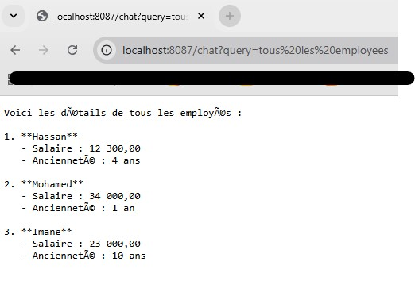
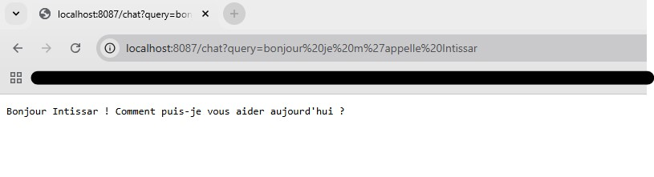
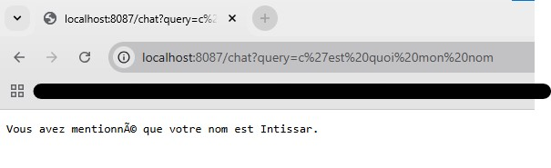
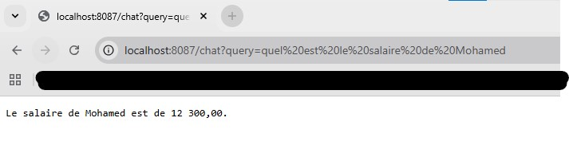
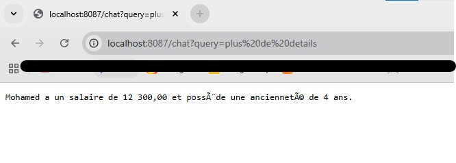

<h2>Premiere test</h2>

<h2>En mode asynchrone</h2>

<h2>Liste des employees</h2>

<h2>Test de memoire</h2>

<h2>Test de memoire avec plus de details</h2>

<h2>Liste des employees avec MCP inspector</h2>

<h2>Affichage d'un employees avec MCP inspector</h2>

<h2>Telegram chatbot</h2>
